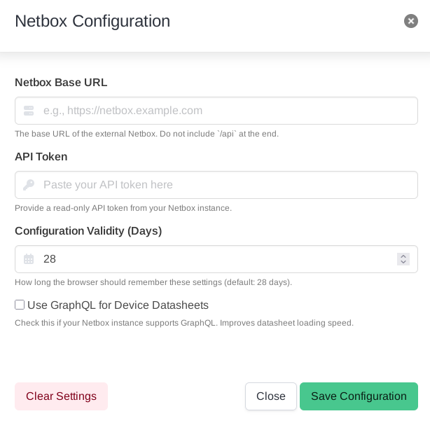
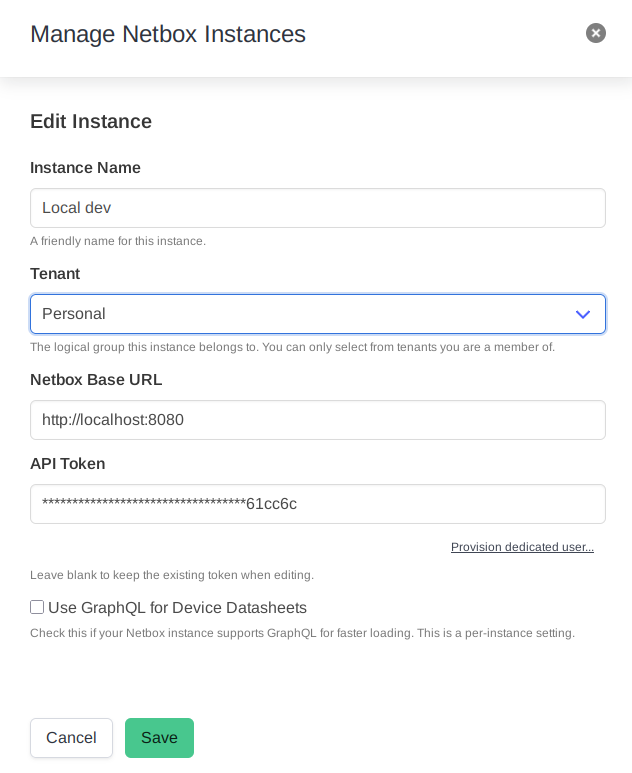
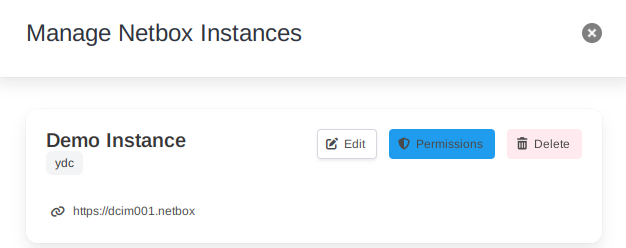

Connecting the portal to your Netbox instance(s) is the first step to unlocking its features. The method you use depends on whether you are using the free, standalone **Devicesheet** tool or the full, authenticated **ydata Portal**.

This guide covers both methods and explains the Netbox permissions required for the portal's features to function correctly.

## Unauthenticated Access (Devicesheet Tool)

The free [Devicesheet tool](https://devicesheet.ydata.ch) uses a simple, browser-based configuration. This method is ideal for individual users or for quick, ad-hoc connections to any Netbox instance.

**Key characteristics:**
*   **Local Storage:** Your Netbox URL and API token are stored securely in your browser's local storage (cookies). They are **never** saved on our servers.
*   **Manual Configuration:** You provide the connection details directly.
*   **Single Instance:** You can only be connected to one Netbox instance at a time.

### How to Configure

1.  Navigate to the [Devicesheet tool](https://devicesheet.ydata.ch).
2.  In the top-right of the navigation bar, click on **Settings**. This opens the "Netbox Configuration" modal.
3.  Fill in the required fields:
    *   **Netbox Base URL:** The full URL of your instance (e.g., `https://netbox.example.com`).
    *   **API Token:** A **read-only** API token from your Netbox instance.
4.  Click **Save Configuration**. A status indicator will appear, confirming the connection is active.

---

## Authenticated Access (ydata Portal)

The full [ydata Portal](https://portal.ydata.ch) provides a robust, multi-user, multi-instance environment integrated with Single Sign-On (SSO). All instance configurations are stored securely in your user account.

### Managing Instances

You can add, edit, and switch between multiple Netbox instances via the "Manage Instances" modal.

1.  Click on your username or the instance selector in the top-right of the navigation bar.
2.  Select **Manage Instances** from the dropdown menu.
3.  From here, you can see a list of your configured instances. Click **Add New Instance** to open the form.
4.  Provide a **Name**, **URL**, and a **API Token**.

### Understanding Required Permissions

The portal is designed to work with a **read-only** token for most of its features. However, to ensure full functionality, a specific set of `view` permissions is required.

There are two primary ways to manage and understand these permissions.

#### 1. The Permissions Overview

Within the "Manage Instances" modal, you can find a link or button to view all required permissions.

*   Clicking **Permissions** opens a modal that provides a comprehensive list of every permission the portal uses.
*   The list is broken down by feature (e.g., "Device Datasheet", "Asset Lifecycle"), making it easy to see which permissions power which tool.
*   This is the ideal reference for a Netbox administrator who needs to create a custom role or group for portal users manually.

#### 2. Feature-Specific Permissions (Shield Icon)

Throughout the portal, you will see a small shield icon <i class="fas fa-shield-halved has-text-info"></i> next to the title of each feature page or section.

*   **Click:** Interacting with this shield icon reveals a tooltip or dropdown that displays the *exact* Netbox permissions required for **that specific feature** to work.
*   **Granular Insight:** This allows you to quickly look up permissions in context without having to search through the full list. It's perfect for troubleshooting why a specific tool might not be loading data.

### Provisioning a Dedicated User (Recommended)

To simplify the process and guarantee that the correct permissions are assigned, the portal offers an automated user provisioning feature.

1.  In the **Add New Instance** form, click the **Provision dedicated user...** link below the API Token field.
2.  A new modal will appear, asking for a `username` for the new portal user in Netbox and a **temporary Admin API Token**.
3.  **Why an Admin Token?** This token is used *only for this one-time operation* to create a new user, a `'ydc-portal-users'` group, and assign the precise set of read-only permissions to that group. The admin token is **never stored**.
4.  Click **Provision**. The portal will connect to your Netbox, perform the setup, and automatically populate the generated read-only token for the new user back into the "Add New Instance" form.

This is the fastest and most reliable way to ensure a correctly configured, secure, read-only connection for the portal.
