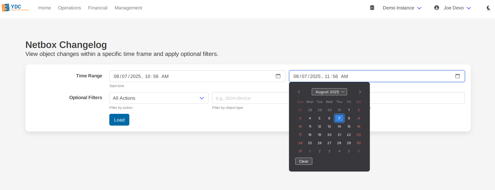
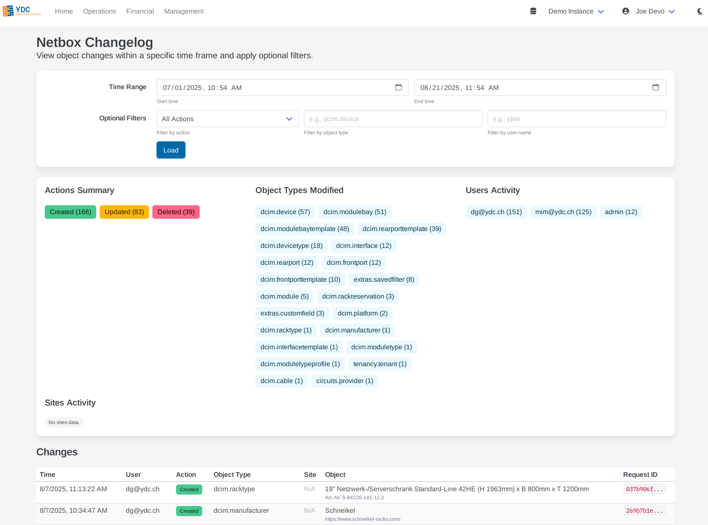

# Feature: Changelog Explorer

The Changelog Explorer provides a powerful interface to search, filter, and analyze your entire Netbox object change history, turning raw logs into actionable insights.

### How to Use the Explorer

1.  **Set a Time Range:** Use the date and time pickers to define the start and end of the period you want to investigate. By default, it shows the activity from the last hour.

2.  **Apply Filters (Optional):** You can narrow your search using any combination of the optional filters:
    *   **Action:** Filter for specific actions like `Created`, `Updated`, or `Deleted`.
    *   **Object Type:** Focus on a specific object, such as `dcim.device` or `ipam.prefix`.
    *   **User Name:** See the activity for a specific user.

    

3.  **Load Changes:** Click the **Load** button to execute your query.

### Interpreting the Results

The tool presents the data in two clear, useful formats.

#### 1. Statistics Dashboard

At the top of the results, a dashboard of statistics boxes gives you an at-a-glance summary of the activity within your query. This includes:
*   **Actions Summary:** A breakdown of create, update, and delete operations.
*   **Object Types Modified:** The top object types that were changed.
*   **Users Activity:** The most active users in the selected time frame.
*   **Sites Activity:** A summary of which sites saw the most changes.

#### 2. Detailed Results Table

Below the dashboard is a detailed table listing every individual change event matching your query. This table includes the timestamp, user, action, object type, the object itself, and the associated site. You can click on object links to view them directly in your Netbox instance.
