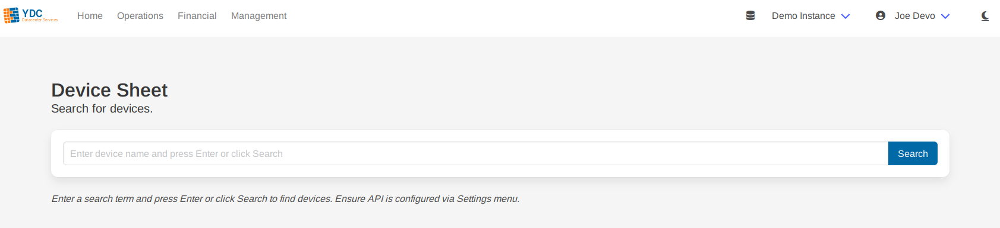
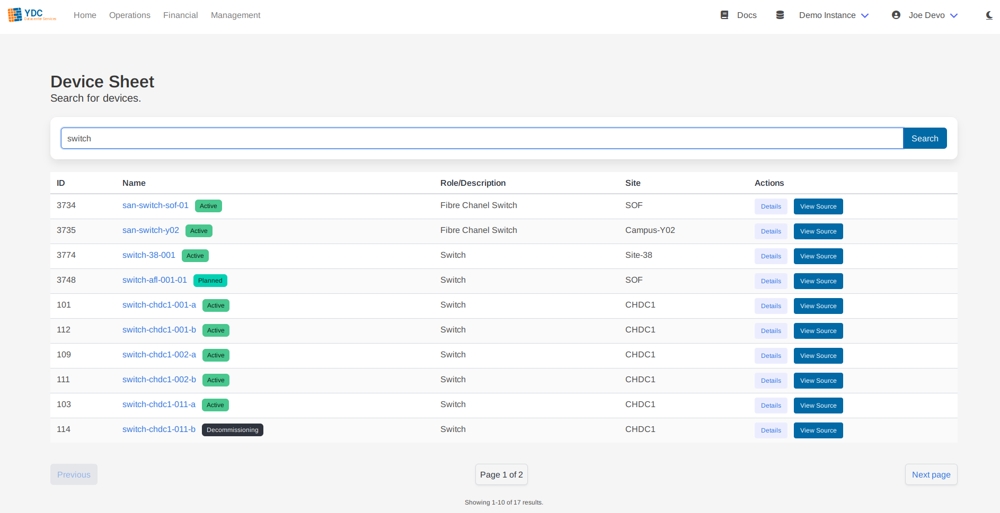
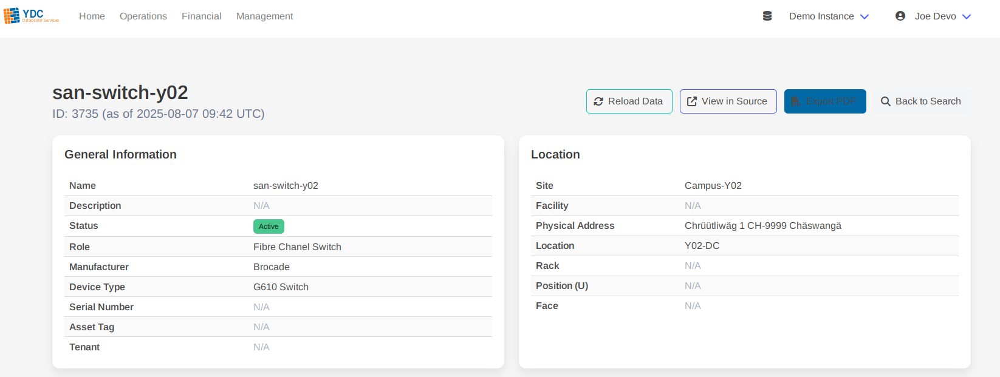
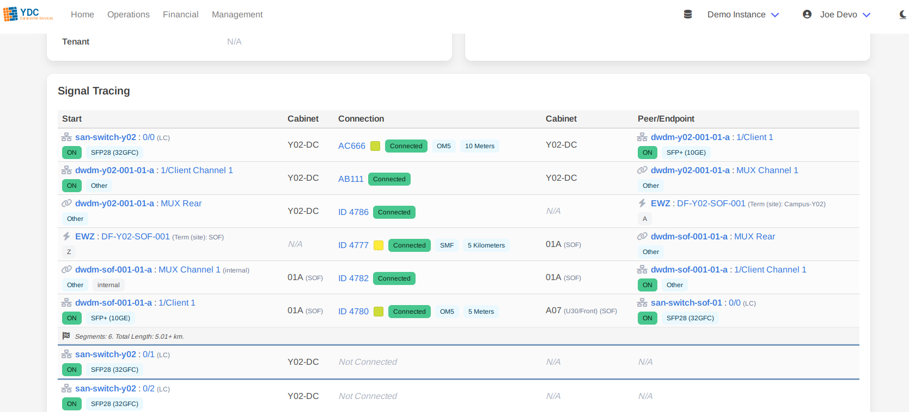

# Feature: Device Datasheet

The Dynamic Device Datasheet is the portal's flagship feature. It provides a comprehensive, single-pane-of-glass view of any device in Netbox, designed for operational efficiency. It goes far beyond a simple data display by performing intelligent, automated signal tracing for all connectable ports.

### How to Use

1.  **Search for a Device:** Navigate to the "Devicesheet" page and enter the name of a device. The search is case-insensitive and supports partial matches. Press Enter or click **Search**.

    

2.  **Select from Results:** A table of matching devices will appear. Click on a device's name or the **Details** button to open its datasheet.

    

3.  **View the Datasheet:** The datasheet will load, presenting all device information in a clean, structured format optimized for engineers.

### Understanding the Datasheet

The datasheet is organized into key sections for quick access to critical information.

#### General Information & Location

These sections provide a summary of the device's core attributes, including its role, type, serial number, and its physical location within a site, rack, and U position.

#### Signal Tracing Table

This is the most powerful part of the datasheet. It automatically traces and visualizes the entire signal path for **every connectable port** on the device—including data, console, and power interfaces.

*   **Holistic View:** Unlike Netbox's native trace function which follows a single path, this table generates traces for *all* ports simultaneously.
*   **Intelligent Augmentation:** The portal's backend enriches the trace data in real-time. It fetches full details for every hop (cables, peer devices, circuits), providing a rich, contextual view that would otherwise require dozens of manual lookups in the Netbox UI.
*   **Intuitive Visualization:** The table uses colors and icons to clearly distinguish between different types of connections:
    *   **External Cable:** A standard connection between two devices.
    *   **Internal Device Link:** A connection between a front port and a rear port on the *same* device.
    *   **Circuit Hop:** A connection that traverses a provider circuit to another site.
    *   **Termination Point:** The unconnected end of a path.

### Exporting to PDF

You can generate a professional, multi-page PDF document of the complete datasheet with a single click.

1.  Click the **Export PDF** button in the top-right corner.
2.  A spinner will appear while the document is being generated.
3.  Your browser will prompt you to save the generated PDF file.

The output is a high-quality, text-based PDF (not a screenshot), making it searchable and perfect for attaching to change requests or providing to field technicians.
