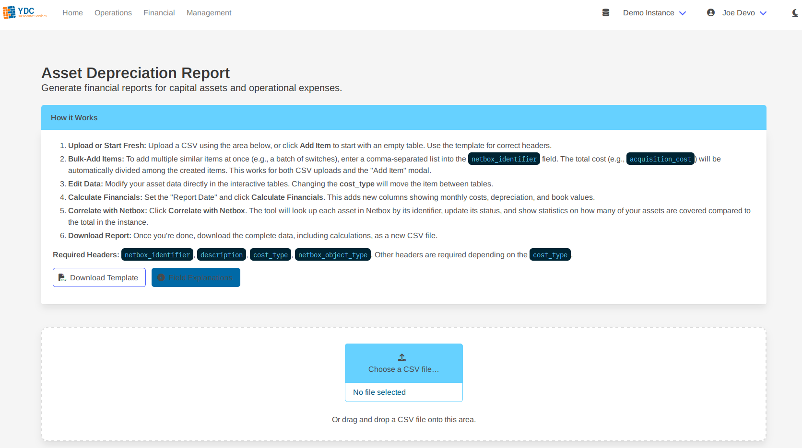
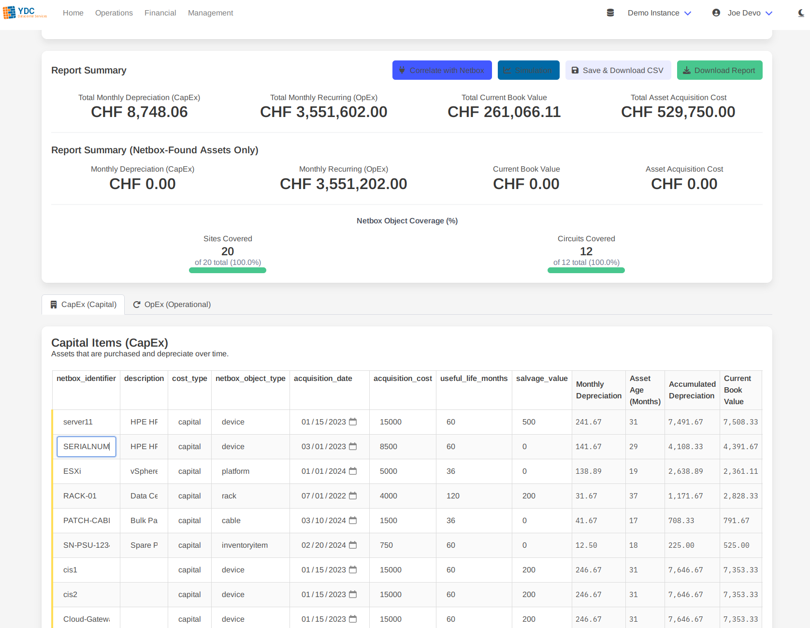

# Feature: Asset Depreciation

This tool is a powerful utility for financial and asset management. It allows you to upload financial data via CSV, correlate it with your live Netbox inventory, and generate comprehensive depreciation reports.

### How it Works: Step-by-Step

The process is designed to be simple and CSV-driven.

1.  **Upload Data:** Begin by uploading a CSV file containing your asset financial data. You can drag and drop the file or use the file selector. A template is provided on the page to ensure you use the correct headers.

    

2.  **Edit In-Browser:** Once uploaded, your data appears in interactive tables. You can click on any editable cell to modify its value. If you change an item's `cost_type` from `capital` to `operational` (or vice-versa), it will automatically move to the correct table.

    

3.  **Calculate Financials:** Set the **Report as of Date** to the desired date for your calculations, then click the **Calculate Financials** button. The portal will add new, read-only columns showing monthly costs, accumulated depreciation, and current book values.

4.  **Correlate with Netbox:** Click the **Correlate with Netbox** button. The tool will look up each asset in your sheet by its `netbox_identifier` (e.g., serial number, asset tag, or name). The status of each row will update to show whether the asset was found, not found, or if there was an error.

5.  **Download Your Report:**
    *   **Save & Download CSV:** This downloads only your edited data, without any of the calculated columns. It's perfect for saving your work-in-progress to re-upload later.
    *   **Download Report:** This downloads the complete dataset, including all original data, financial calculations, and the Netbox correlation status for each asset.

### Understanding the CSV Fields

For the tool to work correctly, your CSV must contain specific headers. Click the **Field Explanations** button on the page for a detailed breakdown.

*   **`netbox_identifier` (Required):** The primary key used to find the asset in Netbox. For best results, use a unique value like a Serial Number or Asset Tag.
*   **`cost_type` (Required):** Must be either `capital` (for depreciating assets) or `operational` (for recurring expenses).
*   **`netbox_object_type` (Required):** The type of object in Netbox (e.g., `device`, `rack`, `circuit`).

> **Pro Tip: Bulk-Adding Items**
> To add multiple similar items from a single purchase order (e.g., a batch of 10 switches), enter their identifiers as a comma-separated list in the `netbox_identifier` field (e.g., `SN001,SN002,SN003`). The tool will automatically create a separate row for each, dividing the total `acquisition_cost` equally among them.
