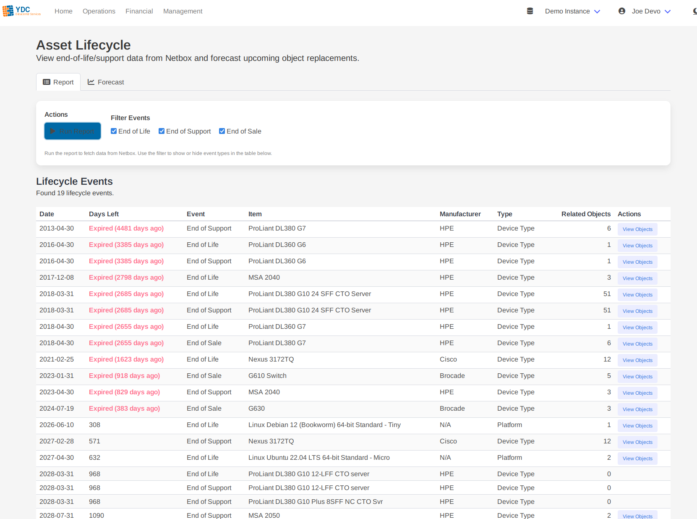
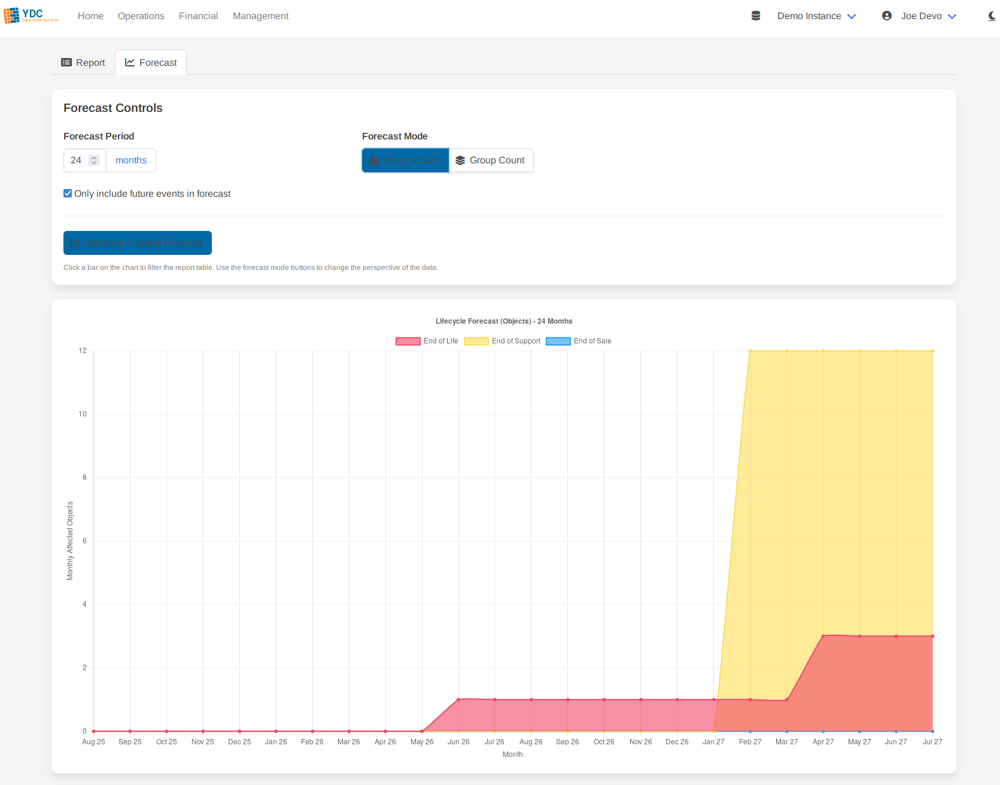

# Feature: Asset Lifecycle

The Asset Lifecycle tool provides a centralized dashboard for all End-of-Life (EOL), End-of-Support (EOS), and End-of-Sale dates recorded in your Netbox instance. It enables proactive planning for hardware refreshes, support contract renewals, and budget forecasting.

**Note:** This feature relies on your Netbox instance having the custom fields `end_of_life`, `end_of_support`, and `end_of_sale` (as `date` types) assigned to objects like Device Types, Devices, or Platforms.

The tool is split into two main views: **Report** and **Forecast**.

### The Report Tab

The **Report** tab is your primary view for all lifecycle events. It presents a comprehensive, sortable table of every object with a defined lifecycle date.

1.  **Run Report:** Click the **Run Report** button to fetch all relevant data from Netbox.
2.  **Review Events:** The table displays each event, showing the date, the number of days remaining, and the affected item. Events that are expired or expiring soon are highlighted for immediate attention.
3.  **View Affected Objects:** For items that represent a group (like a "Platform" or "Device Type"), the table shows a count of all related objects. Click the **View Objects** button to see a popup with a complete list of every device or VM affected by that specific lifecycle event.

### The Forecast Tab

The **Forecast** tab provides a powerful visual chart to help you understand future lifecycle impacts over time.

1.  **Generate Forecast:** After running the report, switch to the **Forecast** tab. Adjust the forecast period (e.g., 24 months) and click **Generate / Update Forecast**.
2.  **Interpret the Chart:** A chart will appear, showing the cumulative number of items that will reach a lifecycle event each month. This makes it easy to spot upcoming periods that will require significant planning and budget.
3.  **Switch Modes:** You can change the perspective of the forecast:
    *   **Object Count:** Shows the total number of *individual assets* (e.g., 50 devices) affected each month. This is useful for understanding the raw scale of impact.
    *   **Group Count:** Shows the number of *product lines* (e.g., 2 device types) affected. This is useful for planning replacements for entire models or platforms.

