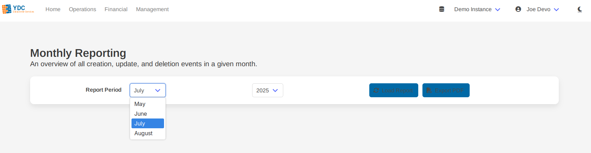
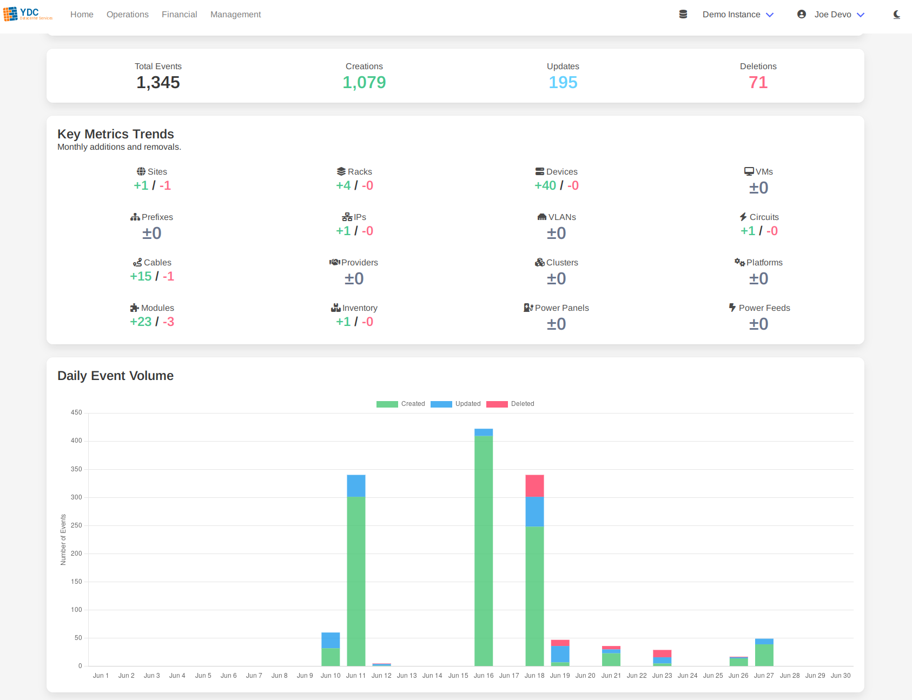

# Feature: Monthly Reporting

The Monthly Reporting tool generates a comprehensive, one-page summary of all activity within your Netbox instance for a selected calendar month. It's designed to give managers and team leads a clear, visual overview of infrastructure changes and growth without needing to write custom scripts or manually parse logs.

### How to Generate a Report

1.  **Select a Report Period:** Use the dropdown menus to choose the desired month and year. The available dates are automatically determined by the age of your Netbox changelog data.

    

2.  **Load Report:** Click the **Load Report** button. The tool will begin fetching and processing all changelog events for the entire selected month. A progress bar will show the status, as this may take a moment for highly active instances.

3.  **View the Report:** The full report is displayed on the page, broken down into several visual sections for easy interpretation.

4.  **Export to PDF:** Click the **Export PDF** button to generate a clean, professional PDF of the on-screen report. This is perfect for sharing with stakeholders, archiving, or including in presentations.

### Understanding the Report Sections

The report is designed to be easily digestible and provides multiple perspectives on your data.

*   **Overall Stats:** A high-level summary of the total number of events, broken down into creations, updates, and deletions for the month.
*   **Key Metrics Trends:** A visual summary showing the *net change* (additions vs. deletions) for your most important asset types, such as Devices, Racks, VMs, and Prefixes. This gives a clear picture of growth or consolidation.
*   **Daily Event Volume Chart:** A bar chart that visualizes the volume of activity for each day of the month, helping you identify peak periods of change or maintenance windows.
*   **Summary Tables:**
    *   **Top Changed Object Types:** Highlights which parts of your data model are seeing the most activity.
    *   **Most Active Users:** Shows which team members are making the most changes.
    *   **Asset Changes by Category:** A detailed table breaking down the create, update, and delete actions for each major asset category.
