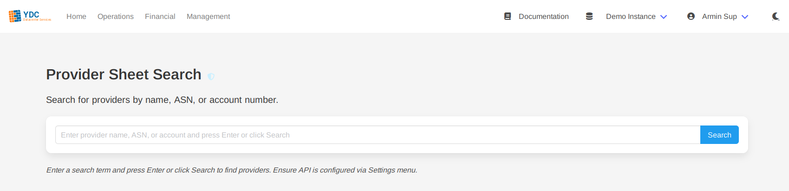
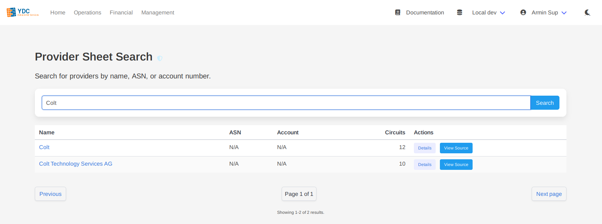
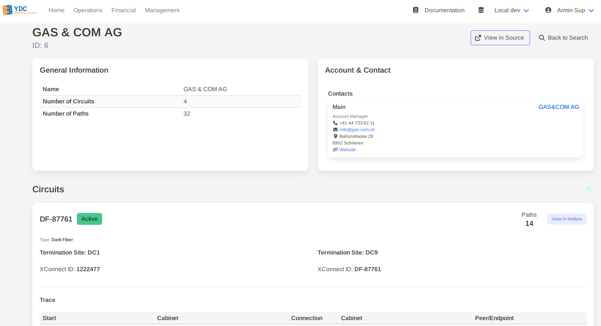
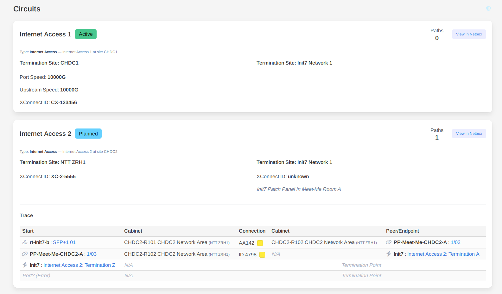

# Feature: Provider Sheet

The Provider Sheet is a powerful tool designed to give you a comprehensive, operational view of any circuit provider and their associated services within Netbox. It aggregates all relevant data—from account details and contacts to a detailed, physical trace of every circuit—into a single, easy-to-navigate interface.

### How to Use

1.  **Search for a Provider:** Navigate to the "Provider Sheet" page. You can search for a provider by their name, ASN, or account number. Press Enter or click **Search**.

    

2.  **Select from Results:** A table of matching providers will appear, showing their name, ASN, account number, and total circuit count. Click on a provider's name or the **Details** button to open their sheet.

    

3.  **View the Provider Sheet:** The full provider sheet will load, presenting all information in a clean, structured format.

### Understanding the Provider Sheet

The sheet is organized into key sections for a complete 360-degree view of the provider.

#### General Information & Account/Contacts

The top section provides a summary of the provider's core attributes, including their account details, ASNs, portal URL, and any assigned contacts from Netbox. This brings crucial contact and account information directly alongside the technical data.

#### Circuits & Automated Path Tracing

This is the core of the feature. The sheet lists every circuit associated with the provider, along with its status, type, and termination points.

Most importantly, the portal automatically performs and displays a full, end-to-end physical path trace for **every single circuit**.

*   **Complete Visibility:** Unlike a manual trace, this provides an immediate, holistic view of your entire provider backbone, showing exactly how each service is physically provisioned through your infrastructure.
*   **Intelligent Data Augmentation:** The trace is enriched in real-time with full details for every hop, including cables, patch panels, peer devices, and even other circuits it may traverse. This turns a complex investigation into a simple visual scan.
*   **Intuitive Visualization:** The trace table uses clear icons and color-coding to distinguish between different connection types, allowing you to instantly understand the path's structure.

This automated tracing capability drastically reduces the time required to validate circuit paths, troubleshoot outages, or plan for migrations, making it an indispensable tool for network and datacenter operations.
