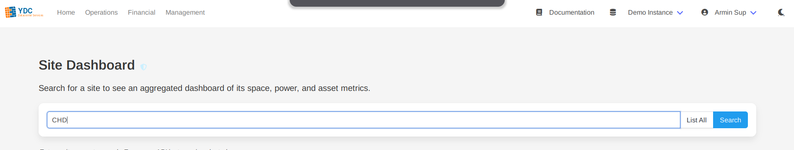
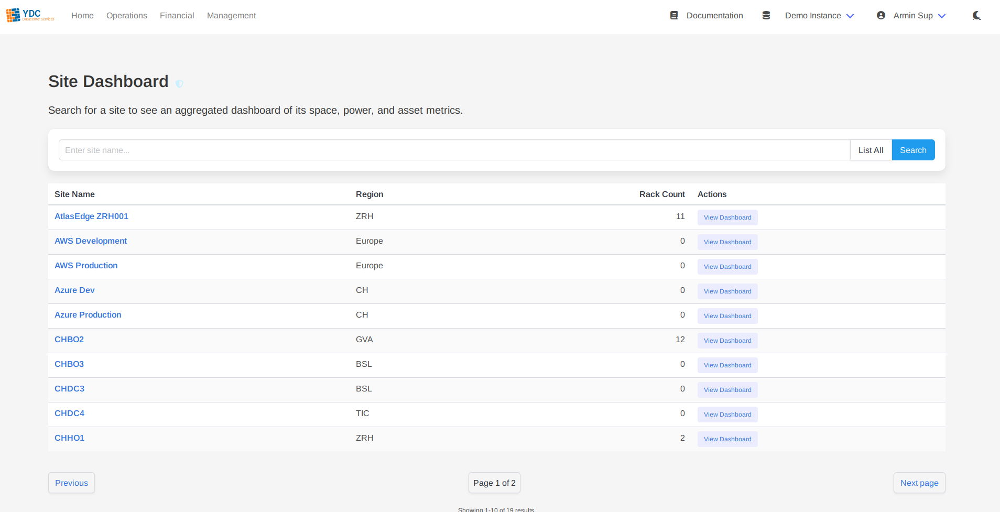
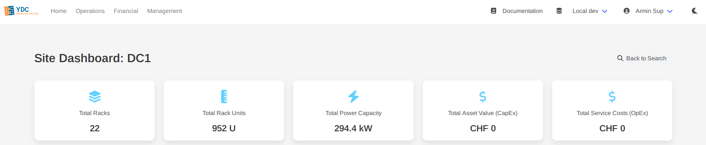
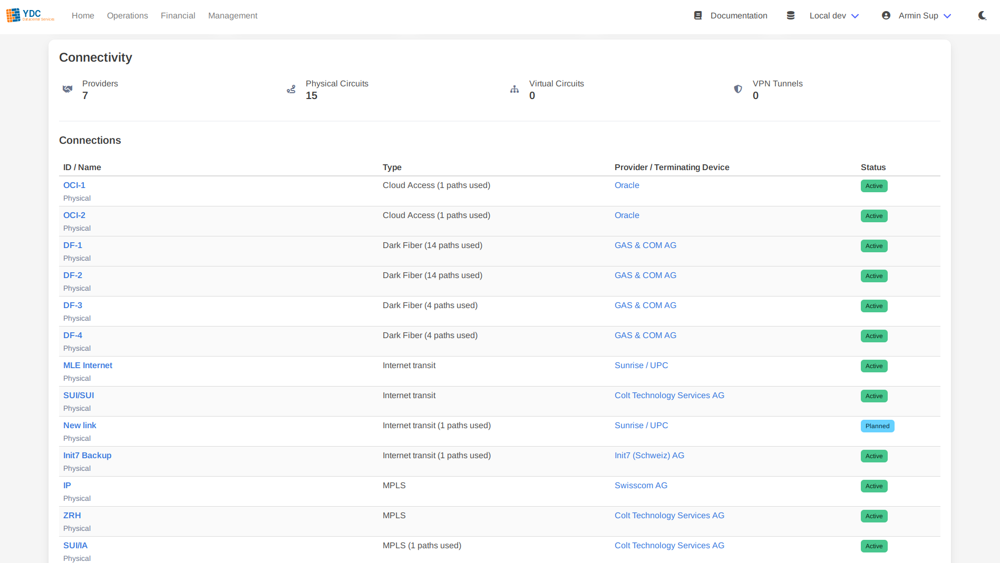
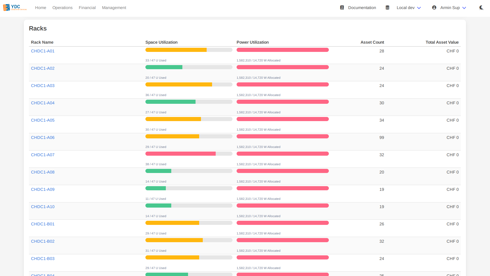

# Feature: Site Dashboard

The Site Dashboard provides a high-level, aggregated view of a single site's key infrastructure metrics. It consolidates data about space, power, connectivity, and assets into a single, easy-to-digest dashboard, making it ideal for capacity planning and operational oversight.

### How to Use

1.  **Search for a Site:** Navigate to the "Site Dashboard" page and enter the name of the site you wish to view. The search is case-insensitive and supports partial matches.

    

2.  **Select from Results:** A table of matching sites will appear, showing the site name, region, and rack count. Click on a site's name or the **View Dashboard** button to open its dashboard.

    

3.  **View the Dashboard:** The dashboard will load, presenting all aggregated site information.

### Understanding the Dashboard

The dashboard is organized into several key sections, providing a comprehensive overview at a glance.

#### Key Performance Indicators (KPIs)

The top of the dashboard features a series of KPI cards that summarize the site's most critical metrics:
*   **Total Racks:** The total number of racks within the site.
*   **Total Rack Units:** The combined rack unit capacity of all racks.
*   **Total Power Capacity:** The total available power capacity in kW.
*   **Total Asset Value (CapEx):** The aggregated capital expenditure value of all assets in the site.
*   **Total Service Costs (OpEx):** The aggregated operational expenditure value of all services in the site.

#### Connectivity

This section provides an overview of all network connections terminating at the site. It includes its own set of KPIs (Total Providers, Physical Circuits, Virtual Circuits, VPN Tunnels) and a detailed table listing every connection. The table shows the connection ID, type, provider, and status, with links to view each object directly in Netbox.

#### Racks

This section provides a detailed breakdown of every rack in the site. The table shows:
*   **Rack Name:** The name of the rack, linked to its view in Netbox.
*   **Space Utilization:** A progress bar visualizing the used vs. total rack units.
*   **Power Utilization:** A progress bar visualizing the allocated vs. available power in watts.
*   **Asset Count:** The number of devices installed in the rack.
*   **Total Asset Value:** The summed value of all assets within that specific rack.

