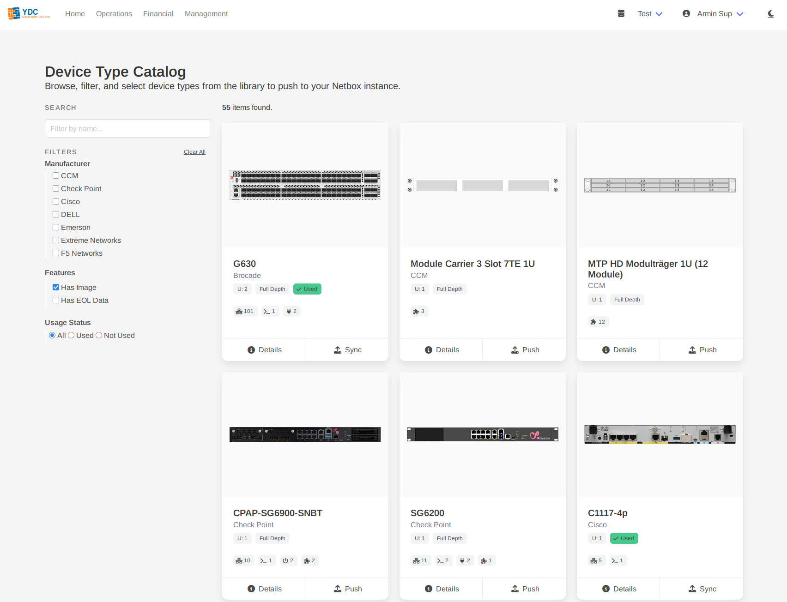
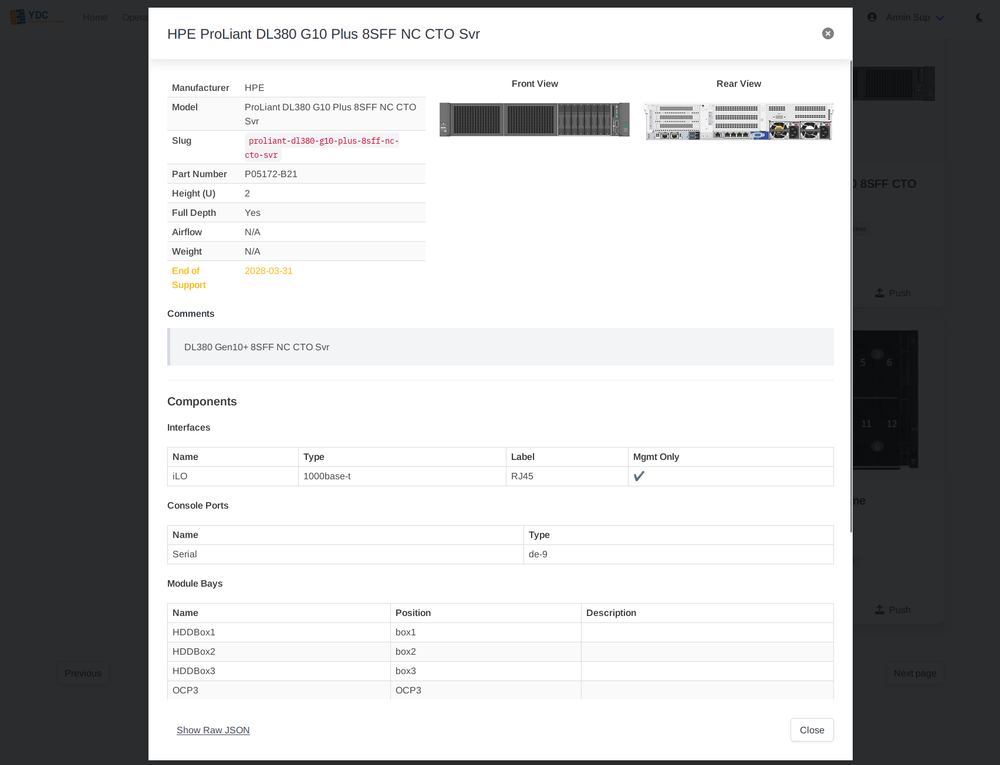
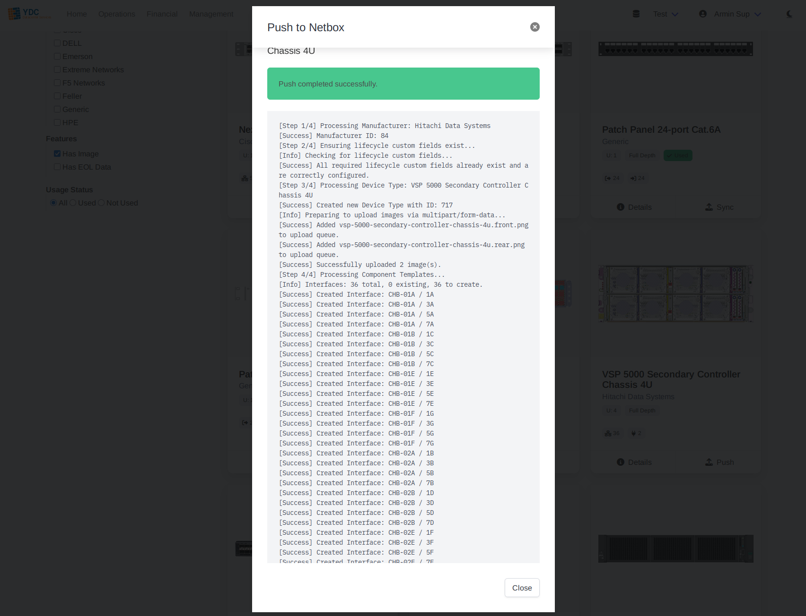

# Feature: Device Type Catalog

The Device Type Catalog provides a curated, standardized library of hardware models that you can push directly into your Netbox instance. This feature is designed to enforce data consistency, improve accuracy, and enrich your Netbox data with valuable lifecycle information.

### Why Use the Catalog?

*   **Standardization:** Prevents inconsistent, user-created device types that often have missing or incorrect component layouts.
*   **Accuracy:** The library is maintained with correct component definitions, part numbers, and high-resolution front and rear elevation images.
*   **Lifecycle Intelligence:** Each device type includes critical End-of-Life, End-of-Support, and End-of-Sale dates, turning your Netbox instance into a proactive tool for lifecycle management.

### How to Use the Catalog

#### 1. Browse and Filter

The main view is a grid of all available device types. You can easily find what you need:
*   Use the **search bar** to filter by manufacturer or model name.
*   Use the **filter panel** on the left to narrow the list by manufacturer, features (e.g., "Has Image", "Has EOL Data"), or usage status in your connected Netbox instance.

#### 2. View Details

Click the **Details** button on any device type card. A modal will appear showing a full breakdown of its specifications, all its component templates (interfaces, power ports, module bays, etc.), and large elevation images.

#### 3. Push to Netbox

Click the **Push** button on a device type card to add it to your Netbox instance. A modal will appear showing a live log of the creation process. The portal intelligently handles the entire operation:
1.  Finds or creates the manufacturer.
2.  Ensures required custom fields for lifecycle data exist.
3.  Creates the device type itself.
4.  Creates all associated component templates (interfaces, ports, etc.).
5.  Uploads the front and rear elevation images.

#### 4. Sync Existing Types

If a device type from the catalog already exists in your Netbox instance (matched by its unique slug), the button will change to **Sync**.

Clicking **Sync** performs a safe, non-destructive update. It will **not** overwrite your existing device type. Instead, it will add any *missing* component templates or lifecycle data from the catalog's definition to your existing entry. This is a great way to enrich and standardize device types that were created manually.
