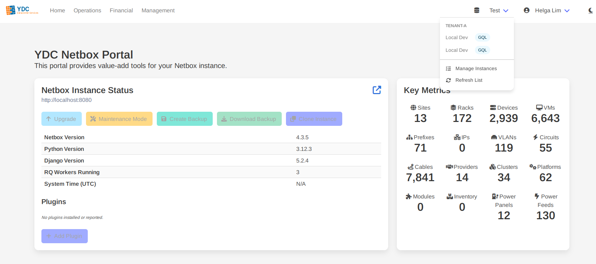
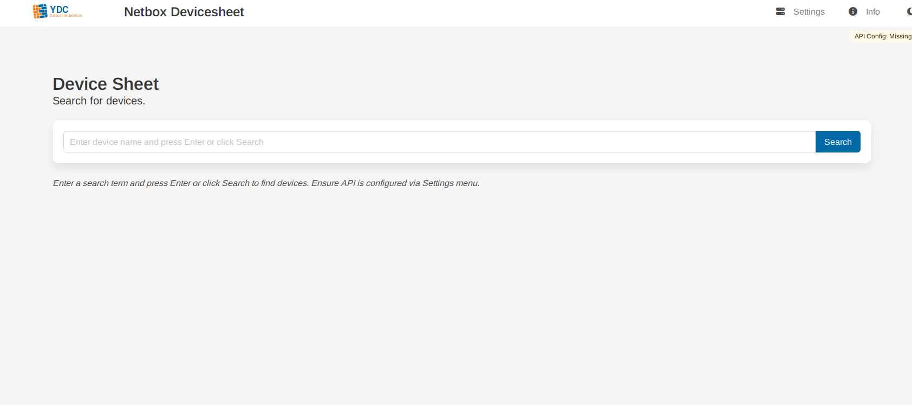
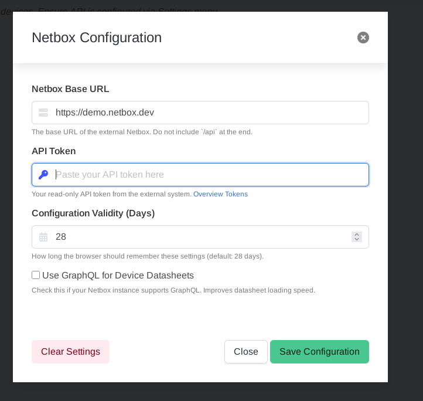

# Getting Started

Welcome to the ydata Netbox Portal! This guide will walk you through the first crucial step: connecting the portal to your Netbox instance.

The connection method depends on how you are accessing the service. The portal can operate in two modes: a full-featured, authenticated **Portal** or a streamlined, standalone **Devicesheet** tool.

## Portal

→ [portal.ydata.ch](https://portal.ydata.ch)

If your organization uses the full portal with Single Sign-On (SSO), your administrator has already configured the available Netbox instances for you. Your job is simply to select the one you want to work with.

1.  **Locate the Instance Selector:** In the top-right of the navigation bar, you will see a dropdown menu. It will either say "Select Instance" or show the name of the last instance you used.

    

2.  **Choose an Instance:** Click the dropdown to see a list of Netbox instances you are authorized to access. These are often grouped by tenant or customer. Simply click on an instance name from the list.

3.  **Ready to Go:** The portal is now connected. The dropdown will update to show the currently active instance, and all tools (like the Devicesheet, Changelog, etc.) will now pull data from it.

> **Tip:** You can switch between different Netbox instances at any time by using this dropdown menu. To add a personal instance or manage existing ones, click "Manage Instances" within the same dropdown.

## Devicesheet (Free version)

→ [devicesheet.ydata.ch](https://devicesheet.ydata.ch)

If you are using the standalone `devicesheet` application, you will configure your Netbox connection manually. This information is stored securely in your browser's cookies and is **never saved on the portal's server**.

1.  **Open Settings:** In the top-right of the navigation bar, click on **Settings**. This will open the "Netbox Configuration" modal.

    

2.  **Enter Your Netbox URL:** In the "Netbox Base URL" field, enter the full URL of your Netbox instance (e.g., `https://netbox.yourcompany.com`). Do not include `/api` at the end.

3.  **Enter Your API Token:**
    *   In a separate tab, log in to your Netbox instance.
    *   Click on your username in the top right and navigate to **Profile** -> **API Tokens**.
    *   Create a new **read-only** token for the portal to use.
    *   Copy the generated token and paste it into the "API Token" field in the portal's settings modal.

4.  **Enable GraphQL (Recommended):** If your Netbox instance has GraphQL enabled, check the **Use GraphQL for Device Datasheets** box. This will make the datasheet feature significantly faster.

5.  **Save Configuration:** Click the **Save Configuration** button. The modal will close. A small status indicator will appear in the top-right corner of the page, showing the name of your connected instance.

    

You are now connected and ready to use the Devicesheet tool!
